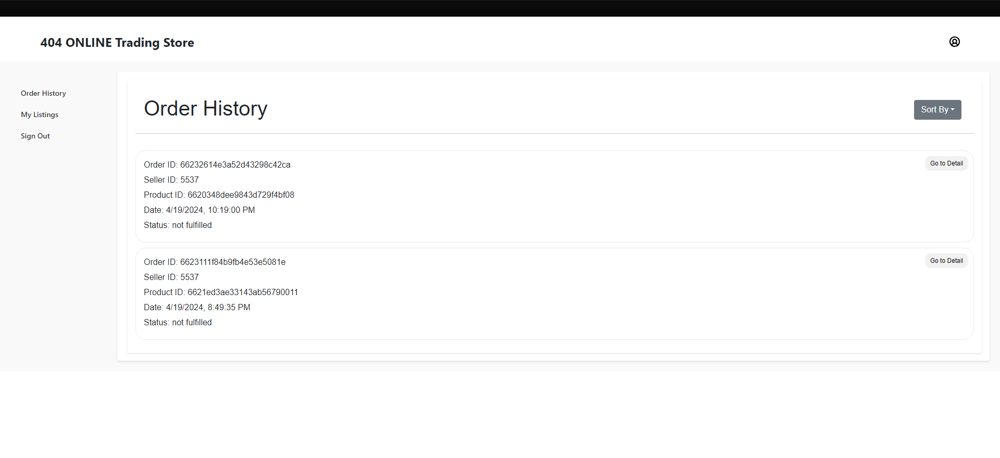

# Final Project - 404 Second-hand Trading Platform
Our inspiration is from [DukeList](https://dukelist.duke.edu/), which is a second-hand trading platform for students. We also try to build a silimar web application that allows users to buy and sell second-hand goods. As for its functions, users can register, login, post an good/item listing, search for goods, and check. The application is built with Node.js 18x, Express.js for backend, Vue for frontend and MongoDB, Atlas for No-SQL database.

## Tech Stack
- Frontend: Vue.js, TypeScript, CSS
- Backend: Express.js, Node.js_18x, TypeScript
- Database: MongoDB Atlas
- CI/CD: Gitlab CI/CD, Gitlab Runner
- Deployment: Kubernetes, Docker
- Authentication: Gitlab OIDC
- E2E Testing: Playwright

## Project Structure 
The project has some main directories and file. The following is the backend structure:
```markdown
- server.ts: This is the entry file of the project, which starts the Express server and sets up some basic middleware and routes.
- controllers/: This directory contains all the route handlers. Each file corresponds to a specific path prefix, for example, user.ts corresponds to the /users prefix.
- models/: This directory contains all the data models. These models define how to interact with the MongoDB database. We use Mongoose.
- services/: This directory contains all the business logic. For example, the userService.ts file contains the logic for user registration.
- utils/: This directory contains some utility functions.
- config/: This directory contains some configuration files.
```

frontend structure:
```markdown
- src/
  - assets/: This directory contains all the static assets, such as images.
  - api/: This directory contains all the API requests functions, which are used by compoenets.
  - components/: This directory contains all the Vue components.
  - router/: This directory contains the Vue router configuration.
```


## Key Features

- Trading Platform:
    - Users can post a listing with detailed information attached, they can edit / delete their own existing listings.
    - Users can buy listings which are posted on the website.
    - Admins are able to unlist a listing if it is inappropriate.

- User side:
  - User registration and login with **Gitlab OIDC** authentication.
  - CRUD (Create, Read, Update, Delete) operations for managing products and listings.
  - OIDC for user account management and `RBAC` (Role-Based Access Control)
  - Supporting check user order history, order retirval, and order status.
  - Post a listing and delete a listing.

- Product side:
  - Sort goods by price and time.
  - Be sold out and be removed from the list.
  - Authentication checking for the goods owner to update the goods information.
  - Cocurrency control for the goods, which means the goods can be updated by only one user at a time.


## How to run locally
1. Backend(Server)

```bash
cd server
npm install # to install all dependencies
npm run start # to run the backend, listening on port 8192
```

2. Frontend(UI)
```bash
cd ui
npm install # to install all dependencies
npm run dev # to run the frontend, listening on port 8082
```

## How to deploy
1. Please refer to the **k8s-guide.md** file for deployment instructions. In a nutshell, you have to download Docker Desktop, enable Kubernetes, and run the following commands in k8s-guide.md file. We also use **Nginx**(expose on default 80 port) as the reverse proxy to route the traffic to the frontend and backend services.

2. For CI/CD, we use Gitlab CI/CD to build and deploy the application. Please refer to the **.gitlab-ci.yml** file for the pipeline configuration. Also, please make sure download the suitable version of Gitlab runner and set the following configurations in the Gitlab project settings:


## Results
### Home Page


### User features



### Product features


## MongoDB 

### OIDC

### K8S

### CI/CD
 
